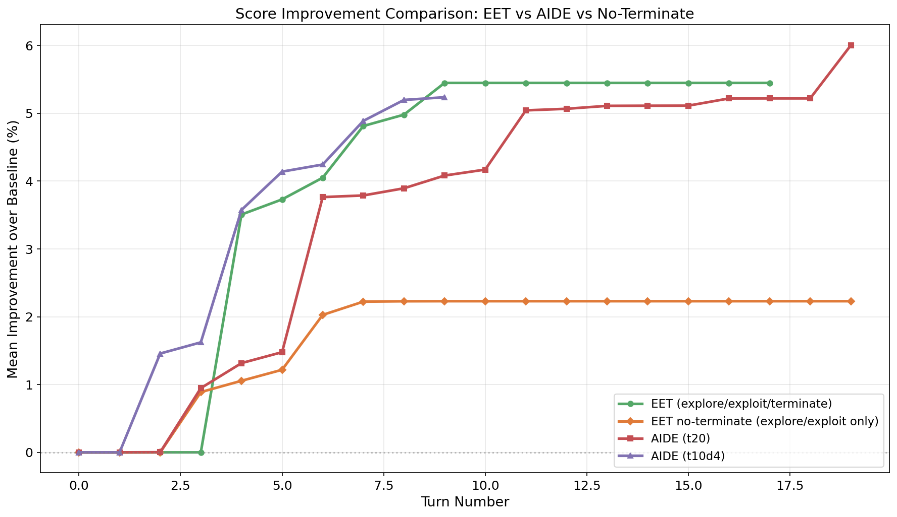
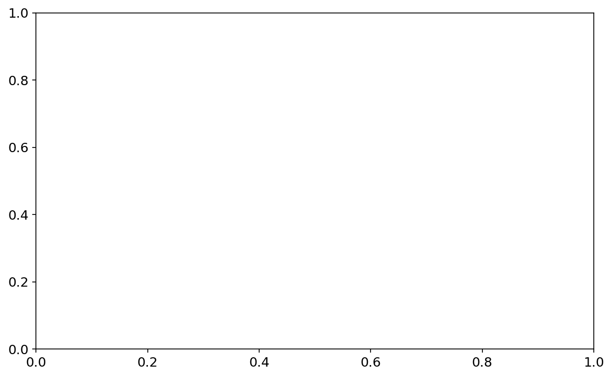
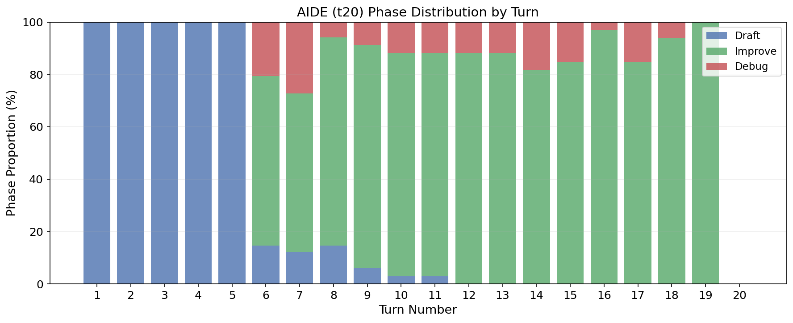
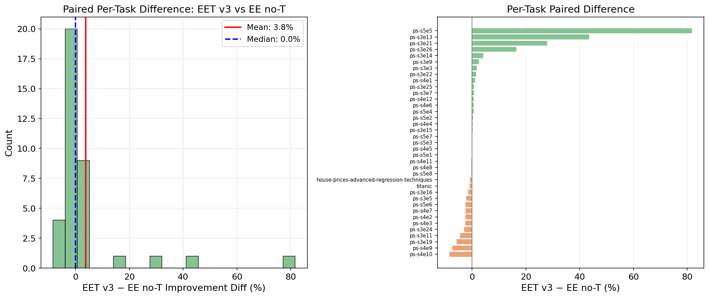
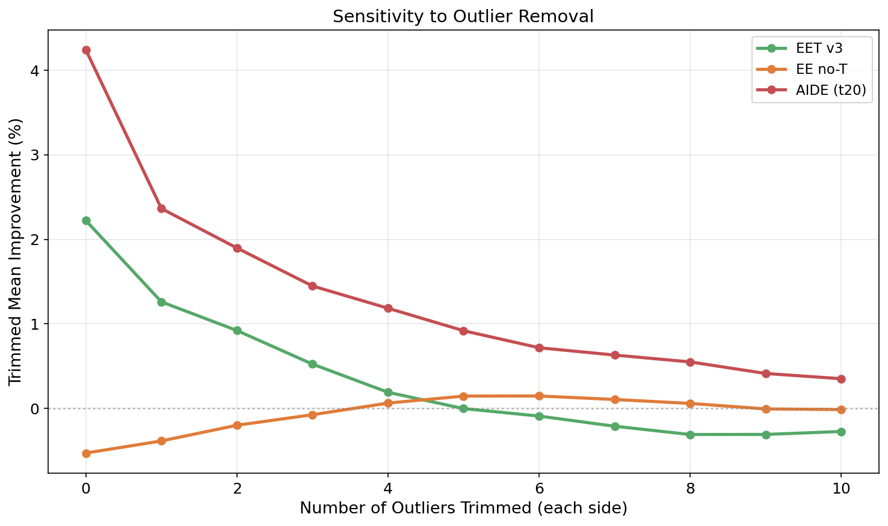
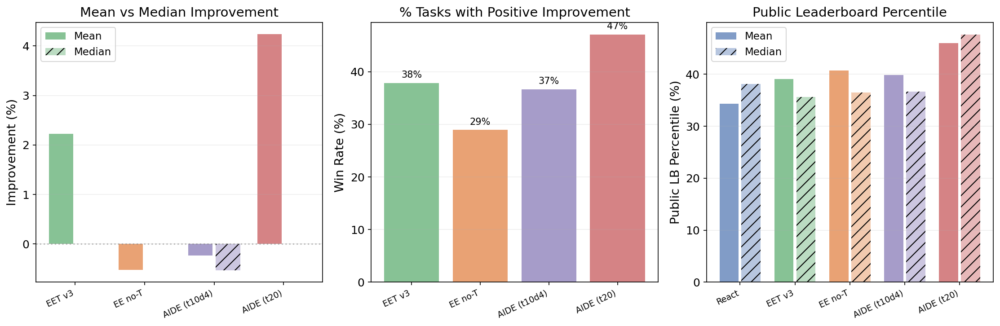

# Action Space 对比分析：EET vs AIDE vs EE (no-Terminate)

> DSPredict-Easy, 38 tasks, Qwen3-235B-A22B-Instruct-2507
> 2026-03-11

---

## 一、实验概要

我们对比了 5 种 agent 在 DSPredict-Easy benchmark 上的表现：

| Agent | 描述 | Max Turns | 关键特性 |
|-------|------|-----------|----------|
| React | 原始 ReAct agent，无结构化动作 | 10 | baseline |
| EET v3 | Explore / Exploit / **Terminate** | ~15 | 模型自主选择动作，可提前终止 |
| EE no-T | Explore / Exploit only（去掉 Terminate） | 20 | 不能终止，强制跑满 |
| AIDE v1 (t20) | Draft(5) / Improve / Debug | 20 | 硬编码 action 策略，前5轮 draft，后面 improve |
| AIDE (t10d4) | Draft(4) / Improve / Debug | 10 | 同上，更少 turns |

评估指标来源：`evaluation_results/{experiment}/*_summary.json` → `metrics.kaggle_submission.details.{public_percentile, private_percentile, public_above_median, private_above_median}`

---

## 二、最终成绩对比

### 2.1 Kaggle Leaderboard Percentile（越高越好）

| Agent | Scored(pub/priv) | Pub Mean Pctl | Pub Above-Med | Priv Mean Pctl | Priv Above-Med |
|-------|------------------|---------------|---------------|----------------|----------------|
| React | 33/31 | 34.3% | 9/33 (27%) | 36.6% | 7/31 (23%) |
| EET v3 | 32/30 | 39.0% | 8/32 (25%) | 47.9% | 14/30 (47%) |
| EE no-T | 30/29 | 40.7% | 9/30 (30%) | 45.0% | 12/29 (41%) |
| AIDE v1 (t20) | 29/28 | **45.9%** | **13/29 (45%)** | **50.9%** | **14/28 (50%)** |
| AIDE (t10d4) | 25/24 | 39.9% | 6/25 (24%) | 45.7% | 10/24 (42%) |

### 2.2 Score Improvement over Baseline（基于 trajectory 内的 best_score vs baseline_score）

| Agent | N | Mean | Median | Trimmed Mean (10%) | Win Rate (>0) |
|-------|---|------|--------|-------------------|---------------|
| EET v3 | 37 | 2.22% | **0.00%** | 0.52% | 14/37 (38%) |
| EE no-T | 38 | -0.53% | **0.00%** | -0.07% | 11/38 (29%) |
| AIDE (t10d4) | 30 | -0.24% | -0.53% | -0.80% | 11/30 (37%) |
| AIDE (t20) | 34 | **4.24%** | **0.00%** | **1.45%** | **16/34 (47%)** |

**关键发现**：所有 agent 的 median improvement 都是 0%（或负）。超过一半的 task 在多轮交互后无法超越第一次有效分数。Mean 被少数 outlier 拉高。

---

## 三、Score Improvement 曲线分析

参考图：`scripts/analysis_output/fig5_combined_score_curves_with_nt.png`



### 3.1 为什么 EET 在 Turn 9 后平了？

**直接原因：95% 的 task 主动 terminate 了。**

EET v3 中 36/38 个 task（95%）通过 `<action>Terminate` 主动终止，平均在 turn 9.2（median=9）：



| Terminate Turn | 数量 |
|----------------|------|
| 5-6 | 6 |
| 7-8 | 12 |
| 9-10 | 9 |
| 11-12 | 7 |
| 14-16 | 2 |

Turn 9 之后曲线 flat，是因为大部分 task 已经停了，剩下的 task 在 forward-fill 最后一个分数。

**对于继续跑的少数 task**，后面的 turn 无法改进的原因：

1. **模型能力饱和**：agent 在 5-7 turn 内已经遍历了主要模型（Ridge → RF → XGBoost），最强的 XGBoost 已经找到，无法突破
2. **执行环境限制**：full-data training timeout（10min 上限），被迫 downsample，效果反而更差
3. **代码截断**：长输出被 truncate，导致后续 step 训练失败

典型 case：
- **s4e7**（19 turns）: turn 5 得到 Logistic Regression 0.8356，之后 14 个 turn 尝试 LightGBM 全部 timeout，零增长
- **s5e1**（18 turns）: 第一个 score 后 16 个 turn 不断重复同一个 pipeline，完全相同的分数

### 3.2 为什么 AIDE 可以持续增长到 Turn 19？

**核心区别：AIDE 的 improve 阶段在做系统性的单变量超参调优。**

AIDE (t20) 的 phase 分布：

| Phase | 占比 |
|-------|------|
| improve | **59.0%** (393/666 turns) |
| draft | 28.2% (188) |
| debug | 8.4% (56) |
| final_submission | 4.4% (29) |



前 5 轮 draft 新方案（等价于 EET 的 explore），之后 **11-13 轮全部用来 improve 当前最佳方案**。每次 improve 只改一个变量（atomic improvement），形成系统化的 grid search：

**典型 case: s3e7**（baseline 0.8456 → final 0.8982, +5.26%）

| Turn | 动作 | 改了什么 | 增幅 |
|------|------|---------|------|
| 1-5 | draft | 多种模型（LR, RF, XGB, LGBM, CatBoost） | — |
| 6 | debug | 修 bug | — |
| 8 | improve | label encoding → one-hot | +1.63% |
| 10 | improve | 加 regularization | +0.27% |
| 11 | improve | learning rate 0.1→0.05 | +0.11% |
| 13 | improve | feature engineering | ±0.00% |
| 17 | improve | depth 7→8 | +0.02% |

**典型 case: s4e11**（baseline 0.9192 → final 0.9395, +2.03%）

| Turn | 改了什么 | 增幅 |
|------|---------|------|
| 10 | depth 6→8 | +1.84% |
| 11-16 | l2_leaf_reg grid: 3→5→6→7 | 微调 |

improve turn 中 **70% 做超参调优**（learning rate, regularization, depth），**30% 做 encoding 变更**。这是 diminishing returns 但持续有效的策略。

**对比 EET**：EET 的 explore/exploit 更偏向"试不同模型"，缺少系统化的超参优化 phase。一旦找到最佳模型类型，就没有进一步提升的机制。

### 3.3 EET vs EE no-T 的差距是 outlier 导致的

从图上看，EET 的 mean improvement（~5.45%）远高于 EE no-T（~2.23%）。但这个差距**完全由 outlier 驱动**。

#### Paired comparison（37 个 common tasks）

| 统计量 | 值 |
|--------|---|
| Mean diff (EET − EE) | +3.77% |
| **Median diff** | **0.00%** |
| EET wins | 18 |
| EE wins | 16 |
| Ties | 3 |

Win rate 接近 50:50（18 vs 16），median diff = 0。**对于典型的 task，两者没有区别。**



#### 3 个 outlier 贡献了几乎全部差距

| Task | EET v3 | EE no-T | Diff |
|------|--------|---------|------|
| **s5e5** | +81.68% | 0.00% | **+81.68%** |
| **s3e13** | +22.98% | -20.49% | **+43.47%** |
| **s3e21** | +27.92% | 0.00% | **+27.92%** |
| 其他 34 tasks | — | — | 总计 -12.88% |

去掉 outlier 后 mean gap 的变化：



| 去掉 top/bottom N | Mean Gap |
|---------------------|----------|
| 0 (原始) | 3.77% |
| 1 | 1.83% |
| 2 | 0.87% |
| 3 | **0.23%**（基本消失） |
| 5 | **-0.20%**（翻转，EE 反而略好） |

---

## 四、指标鲁棒性讨论

### 4.1 "Mean Improvement over Baseline" 的问题

这个指标有两个致命缺陷：

1. **对 outlier 极度敏感**：一个 +81.68% 的 task 可以支配整个 mean。Stdev = 15.9%，典型的 heavy-tailed 分布
2. **Baseline 的选择影响巨大**：如果第一个 score 碰巧很差（如 s5e5），后续任何正常分数都会显示为巨大"改进"

### 4.2 更鲁棒的替代指标

| 指标 | 描述 | Outlier 敏感度 | 推荐 |
|------|------|--------------|------|
| **Median Improvement** | 中位数改进 | 低 | ✅ |
| **Trimmed Mean (10%)** | 去掉两端各 10% 后的 mean | 中 | ✅ |
| **Win Rate** | 正向改进的 task 比例 | 低 | ✅ |
| **Paired Win Rate** | 两两对比胜率（控制 task 变量） | 低 | ✅✅ |
| **Kaggle Public/Private Percentile** | Leaderboard 上的排名百分位 | 中（已 normalize） | ✅ |
| Mean Improvement | 平均改进 | **极高** | ❌ |



### 4.3 用鲁棒指标重新看结论

用 median improvement 和 paired win rate：

| 对比 | Mean 结论 | Median 结论 | Paired Win Rate |
|------|----------|------------|-----------------|
| EET vs EE no-T | EET 大幅领先 (+3.77%) | **无差异** (0.00%) | 18:16 ≈ 持平 |
| AIDE (t20) vs EET v3 | AIDE 领先 (+2.02%) | **无差异** (both 0%) | — |
| AIDE (t20) vs 其他 | AIDE 最好 | AIDE 0%，其他也 0% | — |

**结论**：在鲁棒指标下，所有 agent 的多轮优化能力都很弱。超过一半的 task 无法在首次得分基础上改进。

---

## 五、核心发现总结

### 发现 1: 额外轮次本身就无效

不是"探索效率变差"，而是额外的 turn 根本不产生价值：
- EET 95% 的 task 主动 terminate（avg turn 9.2），说明 agent 自己也认为继续没用
- EE 被迫跑 20 turns，后 10+ turn 零增长
- 所有 agent 的 median improvement = 0%

### 发现 2: AIDE 的持续增长来自系统化超参调优

AIDE 的 improve phase（59% 的 turn）在做 one-variable-at-a-time 调参（learning rate, regularization, depth, encoding）。这是 EET 缺少的机制——EET 的 explore/exploit 偏向"试不同模型"而非"优化同一个模型"。

但这种增长仍然是 diminishing returns：每步改进从 +1.6% 衰减到 +0.02%。

### 发现 3: EET vs EE 差距是 outlier 幻觉

Mean improvement 的 3.77% gap 完全由 3 个 outlier 贡献。去掉 top/bottom 3 后 gap 降至 0.23%。Paired win rate 18:16 ≈ 50:50。

### 发现 4: 真正的瓶颈不在 action space

无论是 EET、AIDE 还是 plain React，Kaggle percentile 都在 34-46% 区间，没有任何 agent 稳定超过 median。瓶颈在于：
1. **执行环境限制**（10min timeout 限制了 full-data training）
2. **模型能力天花板**（Qwen3-235B 作为 frontier model 已经是上限）
3. **task 内在难度**（多数 task 的"最优解"在 5 turn 内就能达到）

---

## 六、数据来源与复现

### 文件路径
- Trajectory 数据：`evaluation_results/{experiment}/*_trajectory.json`
- 评估指标：`evaluation_results/{experiment}/*_summary.json`
  - Percentile 字段：`metrics.kaggle_submission.details.{public_percentile, private_percentile, public_above_median, private_above_median}`
- 绘图脚本：`scripts/plot_combined_score_curves_with_nt.py`
- 图表输出：`scripts/analysis_output/`

### 实验目录
```
evaluation_results/
├── react_qwen3_235b_easy_v2/          # React baseline
├── eet_qwen3_235b_easy_v3/            # EET v3 (explore/exploit/terminate)
├── eet_qwen3_235b_easy_v4/            # EET v4
├── eet_no_terminate_full/              # EE only (no terminate)
├── aide_qwen3_235b_easy_v1/           # AIDE (t20, d5)
└── aide_qwen3_235b_easy_t10d4/        # AIDE (t10, d4)
```
